# AutoML für Anomaliedetection
## Die Methoden — was sie sind & wie sie funktionieren

Tennessee Eastman Process (TEP) · Knappe Methodenübersicht

> Hinweis: mermaid-Diagramme rendern in der VS-Code-Markdown-Vorschau bzw. auf GitHub. Die
> Bullet-Punkte erklären jede Methode auch ohne gerendertes Diagramm vollständig.

---

# Überblick: Grundprinzip & Landkarte

**Anomaliedetection (AD):** lerne den Normalzustand, markiere Abweichungen.
Typen: *univariat* (einzelner Wert), *multivariat* (Struktur), *zeitlich* (Dynamik).

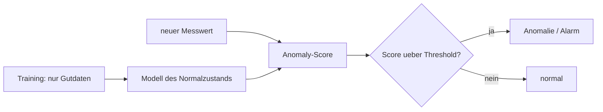

**3 Settings:** unsupervised · semi-supervised · supervised
**4 AutoML-Strategien:** HPO · Frameworks · Meta-Learning/Selektion · Ensembling

---

# Statistische Baseline (Z-Score / PCA)

**Was:** einfachste sinnvolle Referenz — beschreibe Normalität mit Statistik.

**Wie:**
- **Z-Score** (univariat): $z_i = (x_i - \mu_i)/\sigma_i$; Anomalie, wenn $|z_i| > 3$.
- **PCA-Reconstruction** (multivariat): projiziere in den Gutdaten-Unterraum und zurück;
  Score $= \lVert x - \hat{x}\rVert^2$ (großer Rekonstruktionsfehler = Anomalie).
- Threshold: 3σ-Regel oder Quantil der Gutdaten-Scores.

**Einsatz:** Vergleichsanker — zeigt, wie viel die komplexeren Methoden zusätzlich bringen.

---

# Isolation Forest

**Was:** Anomalien sind „few & different" → leichter zu **isolieren**.

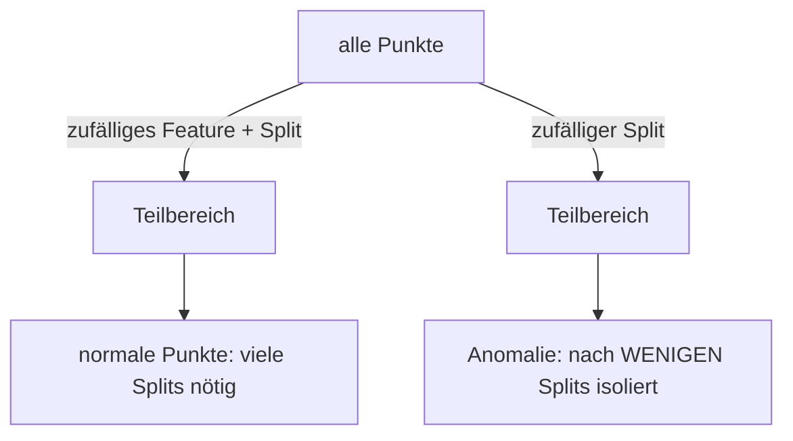

**Wie:**
- Wald aus *Isolation Trees* mit zufälligen Feature-/Schwellwert-Splits.
- Score aus mittlerer Pfadlänge $h(x)$: $s = 2^{-\,E[h(x)]/c(n)}$ (nahe 1 = Anomalie).
- Wenige Hyperparameter, robust, schnell → starke Default-Baseline.

---

# One-Class SVM

**Was:** finde eine Grenze, die möglichst viele Gutdaten einschließt.

**Wie:**
- Trenne die Daten mit maximalem Abstand vom Ursprung (Kernel, meist RBF).
- Alles außerhalb der Grenze = Anomalie.
- Parameter $\nu \in (0,1]$: obere Schranke für den Ausreißeranteil; $\gamma$: Kernelbreite.
- Sehr **HP-sensitiv** ($\nu, \gamma$) → Paradebeispiel für HPO; teuer ($O(n^2)$) → Subsampling.

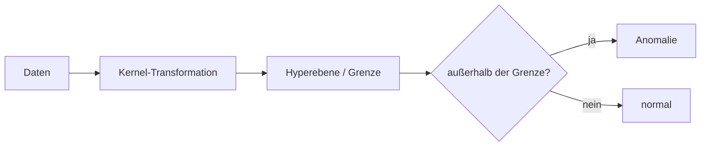

---

# Autoencoder & LSTM-Autoencoder

**Was:** neuronales Netz, das seinen Input rekonstruiert; schlechte Rekonstruktion = Anomalie.

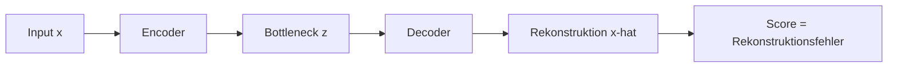

**Wie:**
- Training nur auf Gutdaten → Normalverhalten wird gut, Anomalien schlecht rekonstruiert.
- **LSTM-AE:** Input = Zeit*fenster* → erfasst die **Dynamik** (z. B. langsame Drifts).
- Threshold: Quantil der Rekonstruktionsfehler auf Gutdaten.

**Einsatz:** LSTM-AE erreichte ~0.99 ROC-AUC auf dem Drift-Fehler IDV 13.

---

# Deep SVDD & DeepSAD (semi-supervised)

**Was:** Deep-Learning-Variante der One-Class-Idee.

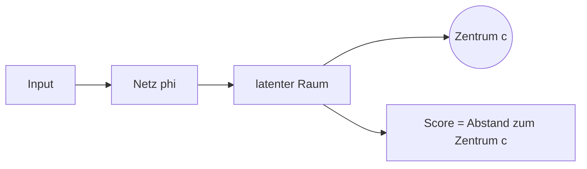

**Wie:**
- **Deep SVDD** (unüberwacht): bilde Gutdaten möglichst nah an ein Zentrum $c$ ab; Score =
  Abstand zum Zentrum.
- **DeepSAD** (semi-supervised): wenige **gelabelte** Anomalien werden vom Zentrum
  **weggedrückt** → großer Sprung (im Projekt 0.985 vs. 0.834 mit nur wenigen Labels).

---

# Self-Organizing Map (SOM)

**Was:** topologie-erhaltende 2D-Karte des Normalzustands (kompetitives Lernen).

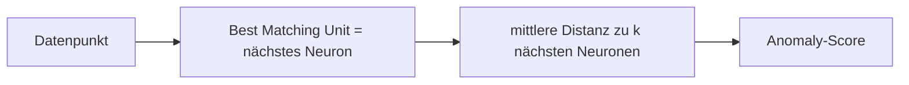

**Wie:**
- Gitter aus Neuronen (Gewichtsvektoren) ordnet sich der Datenstruktur an.
- Score = mittlere Distanz eines Punktes zu seinen $k$ nächsten Neuronen.
- Rauschreduktion: selten getroffene Neuronen entfernen.
- Bonus: anschauliche **U-Matrix**-Visualisierung.

---

# Random-Forest-Fehlerklassifikation (supervised)

**Was:** kein AD, sondern direkte **Klassifikation** — wenn viele Labels vorliegen.

**Wie:**
- Viele Entscheidungsbäume (Bagging + Feature-Subsampling), Mehrheitsentscheidung.
- Klassen: kein Fehler / Fehler 1 / … / Fehler 20.
- Liefert zusätzlich **Diagnose** (welcher Fehler), nicht nur „Anomalie ja/nein".

**Kontrast:** schlägt unüberwachte AD bei vielen Labels — erkennt aber nur **bekannte**
Fehler und braucht teure Labels.

---

# AutoML — Überblick (CASH)

**Was:** automatisiere die ML-Pipeline statt Hand-Tuning.

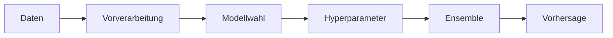

**Begriffe:**
- **HPO:** beste Hyperparameter für ein Modell.
- **CASH:** Modell **und** Hyperparameter gemeinsam wählen.
- **Suchraum:** float/int/kategorisch/**hierarchisch** → keine Gradienten möglich.

---

# Strategie 1: HPO / Bayesian Optimization

**Was:** intelligente Suche statt Raster-/Zufallssuche.

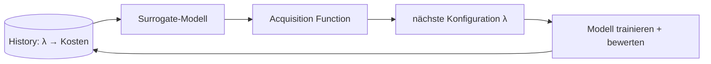

**Wie:**
- **Surrogate** (GP / Random Forest / TPE) schätzt Kosten je Konfiguration billig.
- **Acquisition** (z. B. Expected Improvement) balanciert Exploration/Exploitation.
- Tools: Optuna, SMAC.

---

# Multi-Fidelity: Successive Halving / Hyperband

**Was:** verschwende kein Budget an aussichtslose Konfigurationen.

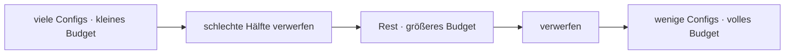

**Wie:**
- **Budget** = Daten-Subsample oder Trainings-Epochen.
- **Hyperband** balanciert viele-billig vs. wenige-teuer; **BOHB** = Hyperband + Bayesian Opt.
- Im Projekt: Hyperband prunt aussichtslose Trials → effizienter bei gleicher Qualität.

---

# Strategie 2: Fertige AutoML-Frameworks

**Was:** End-to-End-CASH „aus der Box" (v. a. überwacht).

**Wie / Bausteine:**
- **Meta-Learning Warm-Start** → **Bayesian Optimization** → **Ensemble Selection**.
- Tools: **auto-sklearn**, **AutoGluon**, **FLAML** (im Projekt genutzt — py3.13-tauglich).
- Gut für Standard-(überwachte)-Probleme; **lösen nicht** das unüberwachte AD-Selektionsproblem.

**Befund:** RF ≈ FLAML ≈ AutoGluon auf der TEP-Klassifikation (kein klarer Gewinner).

---

# Strategie 3: Meta-Learning & Selektion OHNE Labels ★

**Kernproblem:** unüberwacht fehlt das Gütesignal zur Modellwahl.

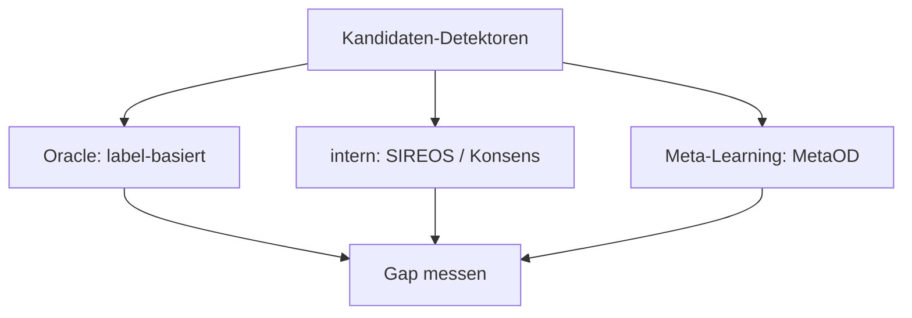

**Wege:** interne Metriken (EM/MV, **SIREOS**), **Konsens/Centrality**, **MetaOD**
(lernt aus Performance auf vielen Benchmarks via Meta-Features).
**Befund:** label-frei (0.854) ≈ Oracle (0.855).

---

# Strategie 4: Ensembling

**Was:** kombiniere mehrere Detektoren statt *einen* besten zu wählen.

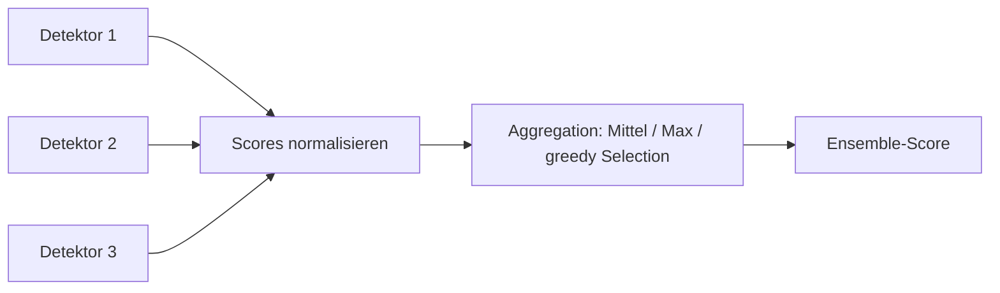

**Wie:**
- Score-Normalisierung (Z-Score) → **Average/Maximum** (label-frei) oder **Ensemble Selection**
  (greedy, label-basiert) bzw. **Feature Bagging** (Diversität).
- Umgeht das Selektionsproblem teilweise; robust nahe am besten Einzeldetektor.

---

# Zusammenfassung: Methode × Einsatz

| Methode | Setting | Typ | Stärke |
|---|---|---|---|
| Z-Score / PCA | unsup. | uni-/multivar. | einfach, schnell |
| Isolation Forest | unsup. | multivariat | robuste Baseline |
| One-Class SVM | unsup. | multivariat | flexible Grenze (HPO!) |
| Autoencoder / LSTM-AE | unsup. | (zeitlich) | nichtlinear / Dynamik |
| Deep SVDD / DeepSAD | un-/semi | multivariat | wenige Labels helfen stark |
| SOM | unsup. | multivariat | Visualisierung |
| RF-Klassifikation | sup. | — | Diagnose, Vergleichspol |

**AutoML-Klammer:** HPO · Multi-Fidelity · Frameworks · Meta-Learning/Selektion · Ensembling.
**Kernaussage:** Modellselektion ohne Labels funktioniert auf TEP nahezu wie mit Labels.
